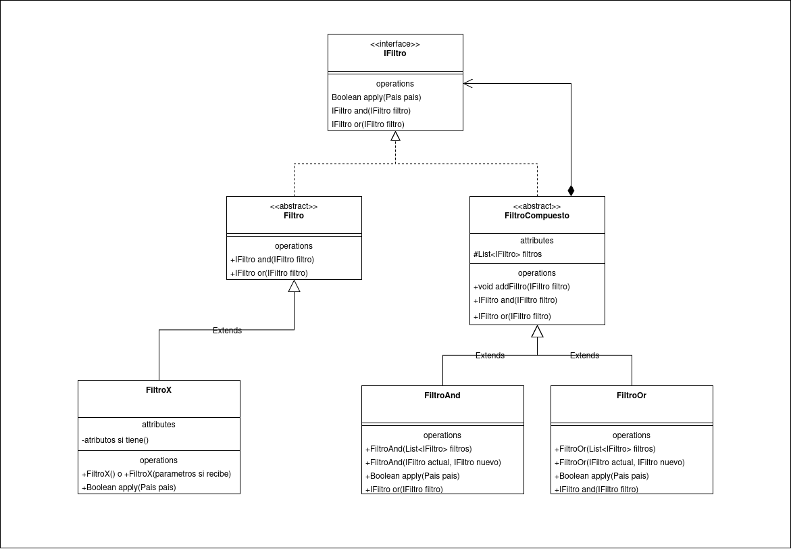

# 🌎 Filtro de Países 

## 🧠 Introducción

En este proyecto vas a trabajar con un conjunto de filtros que permiten aplicar distintos criterios para seleccionar países a partir de su información básica, como la región, el idioma, la población o si es un país insular.

Consiste en desarrollar un sistema extensible y reutilizable que permita combinar filtros de forma flexible, usando método basados en operadores lógicos como **AND** y **OR**, sin modificar la lógica interna de cada filtro. Este ejercicio está inspirado en problemas reales de clasificación y búsqueda avanzada.

# Filtros de Países

## Descripción del Proyecto

Este proyecto tiene como objetivo crear un conjunto de filtros para clasificar países según diversas características, tales como el idioma, si son islas, la población y la región. Los filtros se aplican sobre un objeto `Pais` que contiene la información relevante para cada país.

## Consigna

El sistema debe permitir aplicar distintos filtros a una lista de países para obtener aquellos que cumplen con ciertos criterios. Los filtros implementados en este proyecto incluyen:

1. **Filtro por Area Mayor A**: Filtra países cuya area es mayor o igual a un número específico.
2. **Filtro por Idioma**: Filtra países que hablan un idioma específico.
3. **Filtro por Islas**: Filtra países que son islas.
4. **Filtro por Población Menor A:**: Filtra países cuya población es menor a un número específico.
5. **Filtro por Región**: Filtra países cuya región comienza con un prefijo específico.
6. **Filtro por Nombre**: Filtra países cuyo nombre comienza con un prefijo específico.
7. **Filtro por Capital**: Filtra países cuya capital comienza con un prefijo específico.
8. **Filtro AND**: Permite combinar varios filtros utilizando el operador lógico **AND**, es decir, solo aquellos países que cumplan con todos los filtros serán seleccionados.
9. **Filtro OR**: Permite combinar varios filtros utilizando el operador lógico **OR**, es decir, solo aquellos países que cumplan con al menos uno de los filtros serán seleccionados.

## EXTRA VIAJEROS

Hay personas que les apasiona viajar pero no todos tienen las mismas motivaciones. Los viajeros pueden hablar mas de un idioma pero solo una nacionalidad. En nuestro caso pensamos en 3 principales tipos de viajeros:

### Viajeros Culturales

Quieren conocer paises que cumplan las siguientes condiciones:

1. Con poblaciones menores a la de su pais natal.
2. Que no hayan ido con anterioridad
3. Que no sean de su misma region

### Viajeros Urbanos

Quieren conocer paises que cumplan las siguientes condiciones:

1. Con poblaciones mayores o con un area mayor a la de su pais natal.
2. Que hablen algun idioma que ellos hablan.

### Viajeros Primerizos

Quieren conocer paises que cumplan las siguientes condiciones:

1. Cercanos a su hogar, es decir, paises limitrofes.
2. Que hablen algun idioma que ellos hablan.
3. Que no sean islas.
